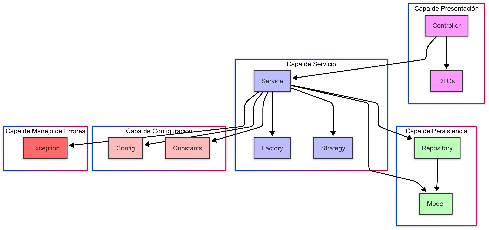
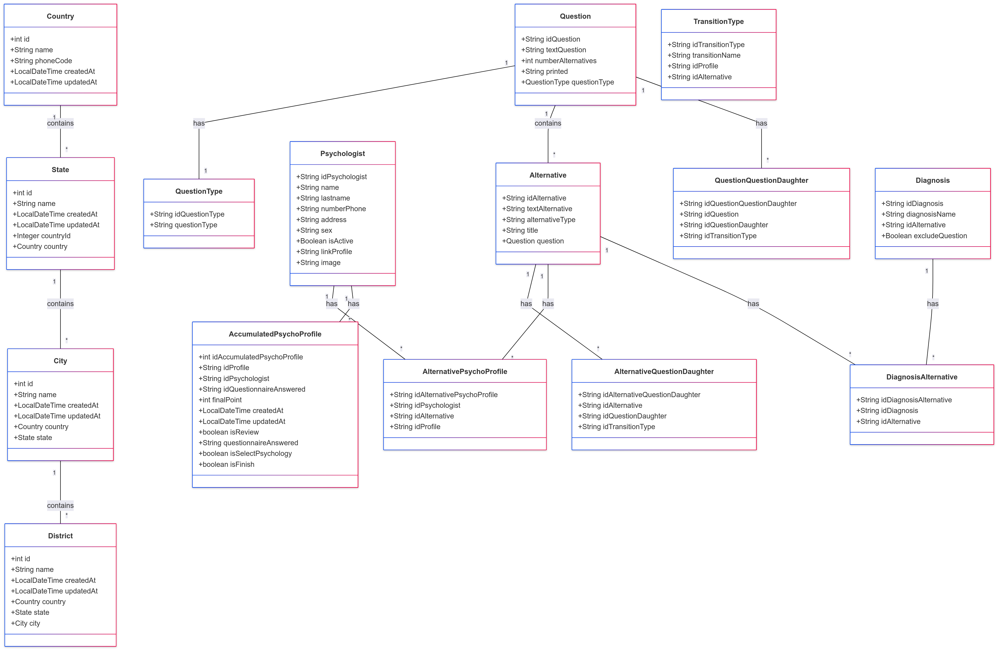
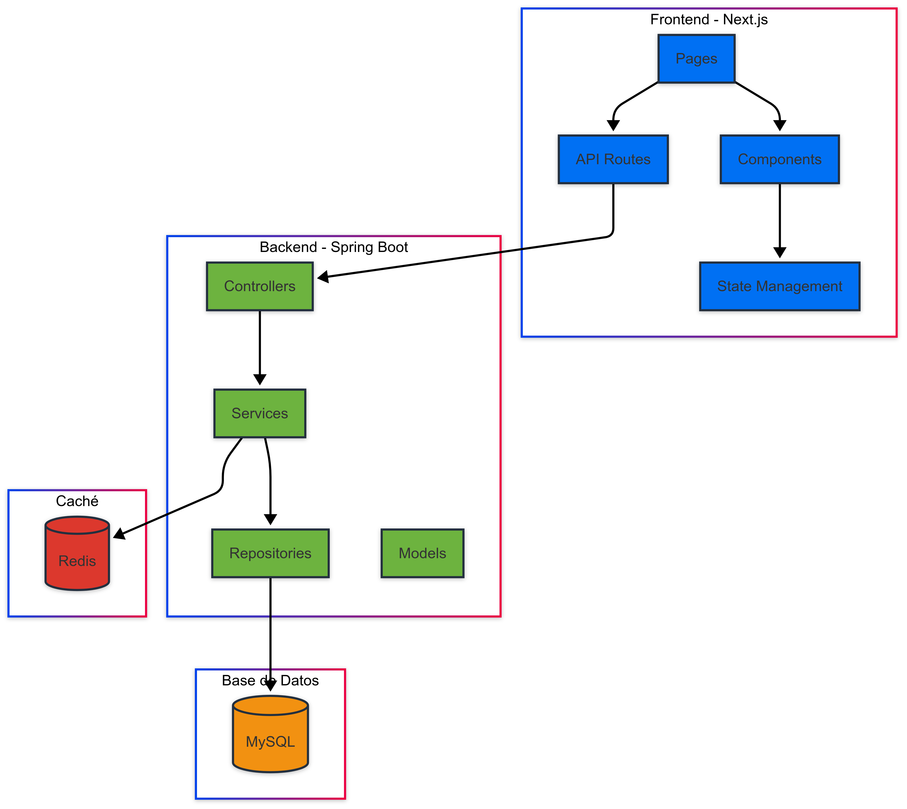
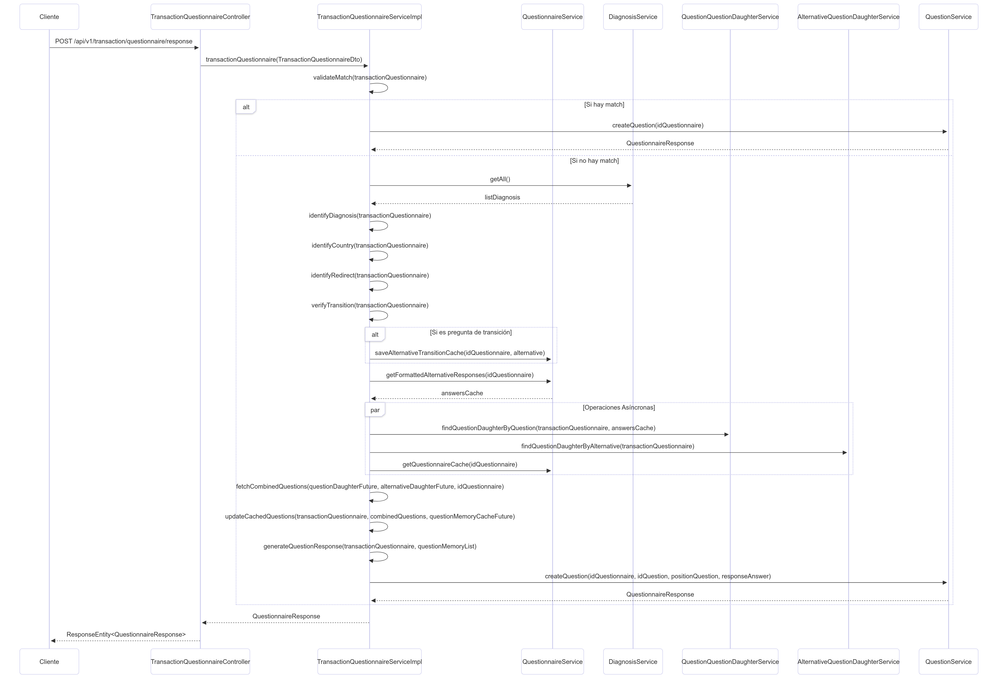
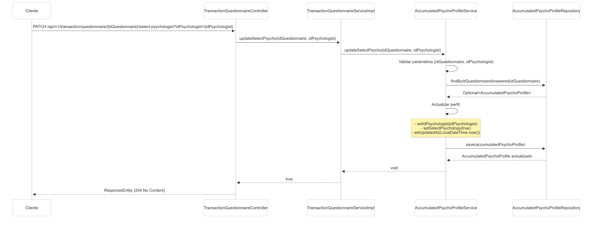
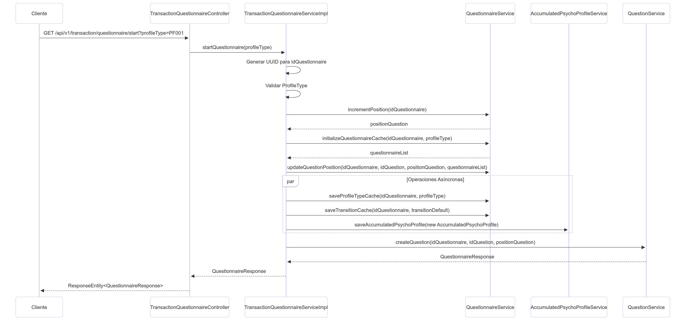
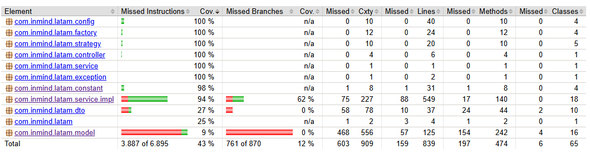

# InMind Latam Backend 🚀

## 📋 Descripción General
InMind Latam Backend es una aplicación Spring Boot que proporciona una API RESTful para la gestión de cuestionarios psicológicos y perfiles de psicólogos, con soporte multi-país y lógica de negocio avanzada. Este backend forma parte de una plataforma más amplia, integrando con un frontend Next.js y utilizando MySQL y Redis para persistencia y caché.

## 🎯 Objetivos del Proyecto
- Proporcionar una API robusta y escalable para la gestión de cuestionarios psicológicos
- Facilitar la integración con diferentes sistemas frontend
- Garantizar la seguridad y confidencialidad de los datos
- Optimizar el rendimiento mediante caché distribuido
- Mantener alta calidad de código y cobertura de pruebas

---

## 📑 Índice
- [Características](#características)
- [Arquitectura](#arquitectura)
- [Diagrama de Entidad-Relación](#diagrama-de-entidad-relación)
- [Arquitectura en Capas](#arquitectura-en-capas)
- [Casos de Uso Principales](#casos-de-uso-principales)
- [Documentación de la API](#documentación-de-la-api)
- [Estructura del Proyecto](#estructura-del-proyecto)
- [Requisitos](#requisitos)
- [Configuración](#configuración)
- [Ejecución del Proyecto](#ejecución-del-proyecto)
- [Soporte Docker](#soporte-docker)
- [Pruebas](#pruebas)
- [Mantenimiento](#mantenimiento)
- [Contribución](#contribución)
- [Licencia](#licencia)

---

## ✨ Características
- ✅ API RESTful para cuestionarios y perfiles de psicólogos
- 🏗️ Arquitectura en capas (Controller, Service, Repository, Model)
- 🔄 Caché distribuido con Redis
- 📚 Documentación de API con Swagger/OpenAPI
- ⚠️ Manejo de excepciones y validación
- 🔍 Patrones de diseño implementados (Factory, Strategy)
- 🌐 Configuración CORS personalizada
- 🔐 Manejo de transacciones y estados
- 📊 Sistema de diagnóstico integrado
- 🔄 Gestión de transiciones entre preguntas
- 🎯 Validación de respuestas y alternativas
- 📝 Sistema de memoria para cuestionarios

---

## 🏗️ Arquitectura

### Arquitectura General


#### Componentes Principales
- **Frontend:** Next.js (Pages, API Routes, Components, State Management)
- **Backend:** Spring Boot (Controllers, Services, Repositories, Models)
- **Caché:** Redis
- **Base de Datos:** MySQL

---

## 📊 Diagrama de Entidad-Relación

### Modelo Entidad-Relación


---

## 🎯 Arquitectura en Capas

### Diagrama de Arquitectura en Capas


#### Capas del Sistema
- **Capa de Presentación:** Controllers, DTOs
- **Capa de Servicio:** Services, Factory, Strategy
- **Capa de Persistencia:** Repositories, Models
- **Capa de Configuración:** Config, Constants
- **Capa de Manejo de Errores:** Exception

---

## 🔄 Casos de Uso Principales

### 1. Transacción de Respuesta al Cuestionario


### 2. Selección de Psicólogo


### 3. Inicio del Cuestionario


---

## 📚 Documentación de la API
- **Swagger UI:** [http://localhost:8080/swagger-ui/index.html](http://localhost:8080/swagger-ui/index.html)
- **OpenAPI Spec:** [http://localhost:8080/v3/api-docs](http://localhost:8080/v3/api-docs)

#### Incluye:
- Endpoints, parámetros, respuestas y modelos de datos
- Pruebas interactivas y ejemplos

---

## 📁 Estructura del Proyecto
```text
src/main/java/com/inmind/latam/
├── config/        # Configuración de Spring, Redis, CORS y seguridad
├── constant/      # Constantes y enumeraciones del sistema
├── controller/    # Controladores REST y endpoints
├── dto/           # Objetos de Transferencia de Datos (request/response)
├── exception/     # Manejo personalizado de excepciones
├── factory/       # Implementaciones del patrón Factory
├── model/         # Entidades JPA y modelos de dominio
├── repository/    # Repositorios de datos y consultas personalizadas
├── service/       # Lógica de negocio y servicios
│   └── impl/      # Implementaciones concretas de servicios
├── strategy/      # Implementaciones del patrón Strategy
└── BackInmindLatamApplication.java
```

---

## 📋 Requisitos
- Java 17+
- Maven 3.8.3+
- MySQL 8.0+
- Redis 7.0+
- 4GB RAM, 2 núcleos CPU mínimo

---

## ⚙️ Configuración
Configure las siguientes variables de entorno:
```bash
SPRING_APP_NAME=nombre_de_la_aplicación
SPRING_DATASOURCE_URL=url_de_mysql
SPRING_DATASOURCE_USERNAME=usuario_db
SPRING_DATASOURCE_PASSWORD=contraseña_db
SPRING_JPA_HIBERNATE_DDL_AUTO=configuración_hibernate
SPRING_REDIS_HOST=host_redis
SPRING_REDIS_PORT=puerto_redis
CACHE_TTL_MINUTES=tiempo_vida_caché
SERVER_PORT=puerto_servidor
```

### Configuración en Producción
El archivo de configuración de producción se encuentra en la instancia EC2 "inmind-qa-backend":

```bash
# Ver el contenido del archivo
cat .env.production

# Editar el archivo
nano .env.production

# Comandos para guardar y salir en nano:
# Ctrl + O  (para guardar)
# Enter     (para confirmar el nombre)
# Ctrl + X  (para salir)
```

### Descripción de Variables
- **Application**: Configuración básica de la aplicación
- **Database**: Configuración de conexión a MySQL
- **Redis Cache**: Configuración del caché distribuido
- **Logging**: Niveles de log por ambiente
- **Security**: Configuración de seguridad y JWT

---

## 🚀 Ejecución del Proyecto
1. Clone el repositorio
2. Configure las variables de entorno
3. Ejecute con Maven:
   ```bash
   mvn spring-boot:run
   ```

---

## 🐳 Soporte Docker
Para construir y ejecutar con Docker Compose:
```bash
docker-compose up --build
```

---

## 🧪 Pruebas
El proyecto incluye una suite completa de pruebas unitarias y de integración:

### Cobertura de Pruebas


El proyecto mantiene una cobertura de pruebas superior al 90% en todos los componentes principales:
- Controladores: >90% de cobertura
- Servicios: >90% de cobertura
- Repositorios: >90% de cobertura
- Configuración: >90% de cobertura

### Pruebas Unitarias
- **Controladores**: Pruebas de endpoints y manejo de respuestas HTTP
- **Servicios**: Pruebas de lógica de negocio y reglas de negocio
- **Repositorios**: Pruebas de consultas personalizadas y operaciones CRUD
- **Configuración**: Pruebas de configuración de Redis, CORS y otros componentes

### Herramientas de Prueba
- JUnit 5 para el framework de pruebas
- Mockito para simulación de dependencias
- AssertJ para aserciones más legibles
- Spring Test para pruebas de integración
- JaCoCo para análisis de cobertura de código

### Ejecución de Pruebas
```bash
# Ejecutar todas las pruebas
mvn test

# Ejecutar pruebas específicas
mvn test -Dtest=QuestionnaireServiceImplTest

# Ejecutar pruebas con cobertura
mvn test jacoco:report
```

### Detalles de Cobertura
- **Controladores**: Pruebas de endpoints y validaciones
- **Servicios**: Pruebas de lógica de negocio y casos de uso
- **Repositorios**: Pruebas de consultas y operaciones de base de datos
- **Configuración**: Pruebas de beans y configuración de Spring

---

## 🛠️ Mantenimiento

### Actualizaciones
- Actualizaciones de dependencias mensuales
- Revisión de seguridad trimestral
- Mantenimiento de versiones LTS

## 🤝 Contribución

### Proceso de Desarrollo
1. Crear una rama feature (`feature/nombre-feature`)
2. Desarrollar y probar los cambios
3. Asegurar cobertura de pruebas >90%
4. Crear Pull Request con descripción detallada
5. Revisión de código y aprobación
6. Merge a rama principal

### Guías de Estilo
- Seguir convenciones de código Java
- Documentar APIs con Swagger
- Mantener tests actualizados
- Usar mensajes de commit descriptivos

### Ambiente de Desarrollo
```bash
# Configuración del IDE
- Java 17
- Maven 3.8.3+
- Lombok plugin
- Spring Boot Tools

# Extensiones recomendadas
- SonarLint
- CheckStyle
- GitLens
```

---

## 📄 Licencia
Este proyecto es propiedad de InMind Latam.

---

## 📝 Notas Adicionales

> **Nota:** Los diagramas incluidos en esta documentación corresponden a los adjuntados por el equipo y se encuentran en la carpeta `resources/images/` del repositorio. Si necesitas editarlos, reemplaza los archivos en esa carpeta.
